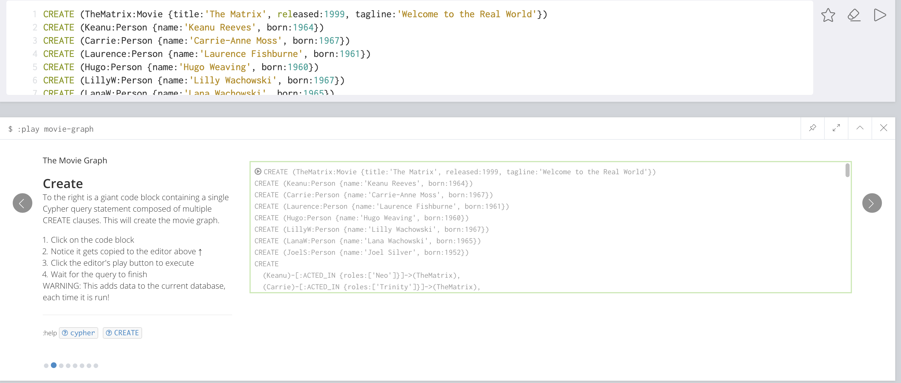
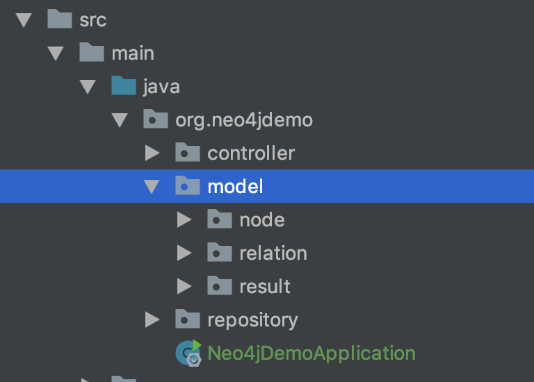
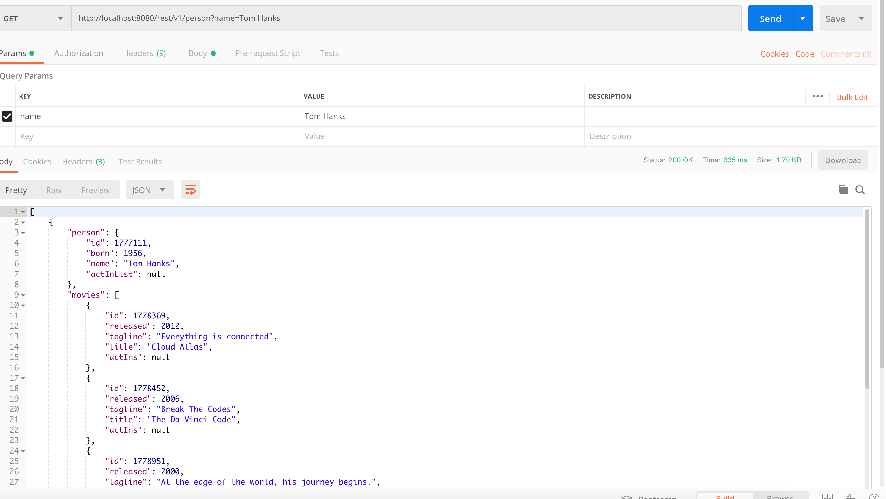
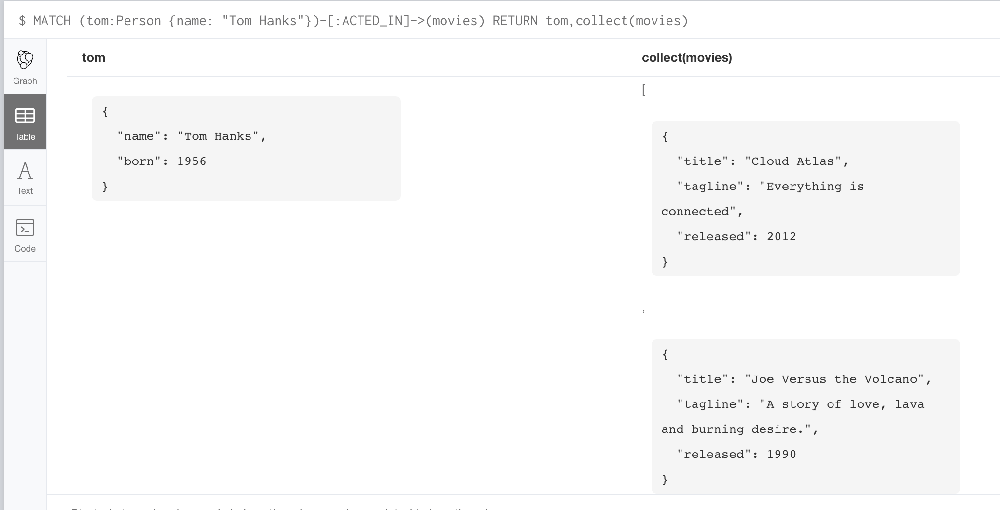
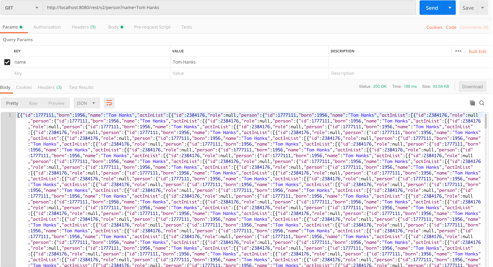
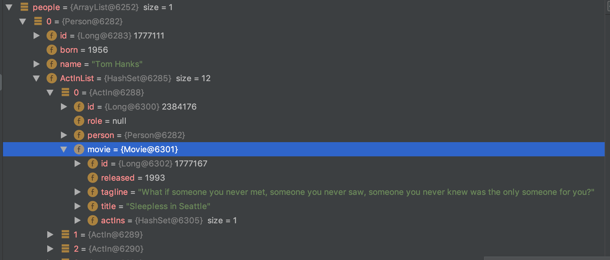

# Springboot整合neo4j OGM框架实践

## 1. 数据准备

首先,准备往你的测试使用的neo4j数据库中倒入数据, 方便起见本文直接使用neo4j Getting Started中的The Movie Graph, 在neo4j的browser中就可以看到, 代码400多行就不贴了.




如果你的neo4j中有数据, 请先执行命令清空数据库.

```
MATCH (n) DETACH DELETE n
```

## 2. 一步一步写代码

数据已经有了我们就可以开始写代码了.

### 2.1 创建工程

- 工程目录结构如下图所示.

  

创建maven工程并且编辑你的pom.xml引入你需要的依赖包, 此处我们主要是使用spring-boot-starter-data-neo4j提供的OGM框架的功能.

``` xml
		<parent>
        <groupId>org.springframework.boot</groupId>
        <artifactId>spring-boot-starter-parent</artifactId>
        <version>1.5.9.RELEASE</version>
    </parent>

    <dependencies>
        <dependency>
            <groupId>org.springframework.boot</groupId>
            <artifactId>spring-boot-starter-web</artifactId>
        </dependency>
        <dependency>
            <groupId>org.springframework.boot</groupId>
            <artifactId>spring-boot-starter-data-neo4j</artifactId>
        </dependency>
        <dependency>
            <groupId>org.neo4j</groupId>
            <artifactId>neo4j-ogm-bolt-driver</artifactId>
            <version>2.1.1</version>
        </dependency>
    </dependencies>
```


- 编辑application.properties文件, 配置访问neo4j数据库所需的属性.

  ```properties
  spring.data.neo4j.username=neo4j
  spring.data.neo4j.password=****
  spring.data.neo4j.uri=bolt://localhost:7687
  ```

>  注意: 我们在这里饮用了neo4j bolt驱动包, 这是因为我们要使用bolt来获取数据库连接, 如果使用browser默认提供的7474端口来访问的话就不需要引入bolt驱动包, 如果不引入驱动包去使用bolt获取数据库连接将会导致SpringBoot启动阶段发现NoClassFoundException, 导致启动失败.
>
> 当然, 使用驱动获取数据库连接才是推荐做法.

### 2.2 创建节点和关系模型

我们此处用演员和电影来举例, 所以需要用到的模型有Person和Movie的点以及ACTED_IN的关系, SpringBoot-data-neo4j-ogm中定义的注解语义都很明确这里就不罗列了.

```java
@NodeEntity(label = "Person")
public class Person {
    @GraphId
    private Long id;

    @Property
    private int born;

    @Property
    private String name;

    @Relationship(direction = Relationship.OUTGOING, type = "ACTED_IN")
    private Set<ActIn> ActInList;

}

```

```java
@NodeEntity(label = "Movie")
public class Movie {
    @GraphId
    private Long id;

    @Property
    private int released;

    @Property
    private String tagline;

    @Property
    private String title;

    @Relationship(direction = Relationship.INCOMING, type = "ACTED_IN")
    private Set<ActIn> actIns;
}
```

```java
@RelationshipEntity(type = "ACTED_IN")
public class ActIn {
    @GraphId
    private Long id;

    @Property
    private String role;

    @StartNode
    private Person person;

    @EndNode
    private Movie movie;
}
```


### 2.3 写查询

创建reporsitory来写查询, reporsitory类似于dao层, Neo4jRepository中提供了通过函数名字来查询的方法, 类似于JPA. 这种我看网上博客写的很多, 但是我个人不倾向于这种方式来查询, 在企业应用中自己写查询对复杂查询的性能更有优势, 所以这里也只讲这种方法, 通过@Query注解来手写CQL.

```java
public interface PersonRepository extends Neo4jRepository<Person, Long> {
    @Query("MATCH (person:Person {name: {name}})-[r:ACTED_IN]->(movie) RETURN person,collect(movie) as movies")
    List<PersonMovie> getPersonMoviesbyName(@Param("name") String name);
    @Query("MATCH (person:Person {name: {name}})-[r:ACTED_IN]->(movies) RETURN person,r,movies")
    List<Person> getPersonByName(@Param("name") String name);
}
```

这里我们主要说两种的查询方式, 一种是直接返回定义的模型, 第二种是使用@QueryResult来类似关系型数据库一样来返回结果.

使用@QueryResult, 定义查询结果模型代码如下所示.

```java
@QueryResult
public class PersonMovie {
    private Person person;

    private Set<Movie> movies;
}
```

> 注意使用@QueryResult接受返回结果时, 属性名要与查询返回的列名相一致, 否则接受不到返回结果.

### 2.4 创建Controller

创建RestController作为测试使用.

```java
@RestController
public class PersonController {
    @Autowired
    private PersonRepository personRepository;

    @RequestMapping(method = RequestMethod.GET, path = "/rest/v1/person")
    public List<PersonMovie> getMoviesByPersonName(@RequestParam String name) {
        return personRepository.getPersonMoviesbyName(name);
    }

    @RequestMapping(method = RequestMethod.GET, path = "/rest/v2/person")
    public List<Person> getPersonRels(@RequestParam String name) {
        List<Person> people = personRepository.getPersonByName(name);
        return people;
    }
}
```

## 3 测试结果

- 调用/rest/v1/person结果如下图所示.

  

  从Rest接口来看, 返回了演员Tom Hanks的基本信息和参演过电影的基本信息, 这里其实与关系型数据库是类似的, 返回结果即是一个可以用的表来展示的数据.

  

  

- 调用/rest/v2/person结果如下, 从结果我们可以看出, 由于模型中Person和ACTED_IN在属性中对彼此相互包含,  所以序列化成json时, 结果已经变成了不可解析的无限长字符串, 但是实际上, 我们可以从面向对象的角度来看, 这里其实是返回了完整的图的.

  

  

## 4 总结

1. 一般情况下, 如果只需要完成查询节点的工作, 更建议使用@QueryResult方法, 返回所需数据即可, 这种方式我们不用担心json序列化的问题
2. 如果你需要完整的图信息, 并在你的java代码里进行计算